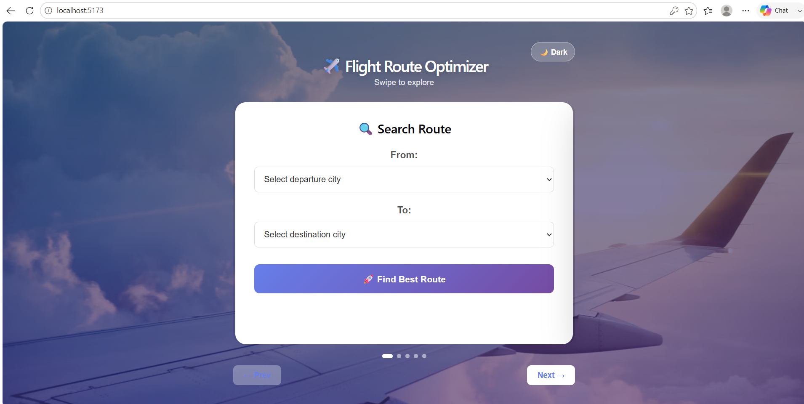
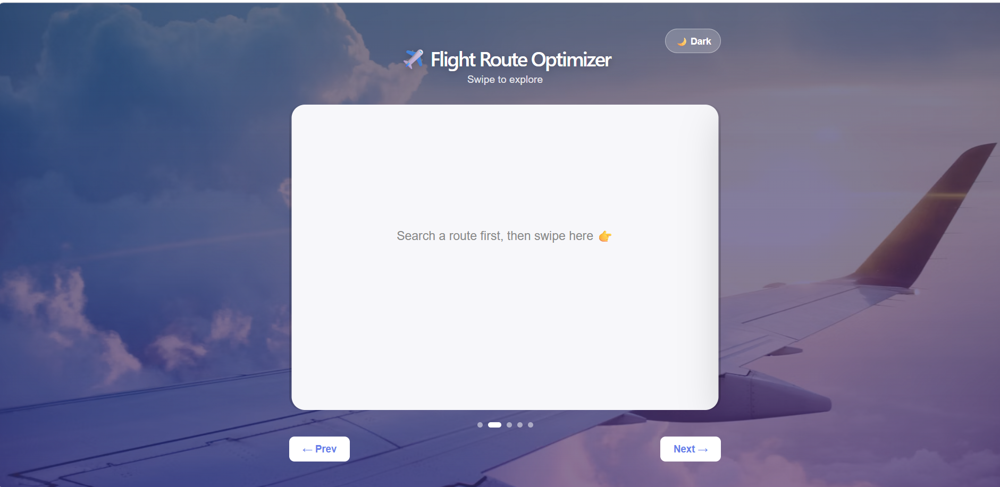
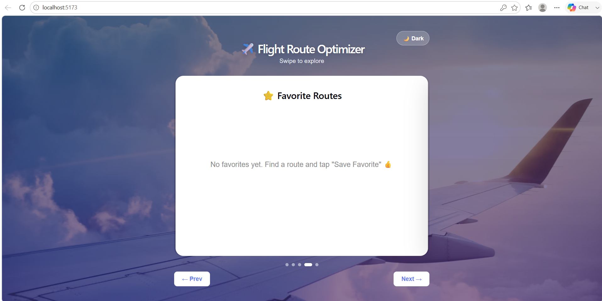

# ✈️ Flight Route Optimizer

A smart Flight Route Optimizer that finds the shortest flight route using **Dijkstra's Algorithm** and predicts flight delays using **Machine Learning**.

## 🚀 Features

- ✈️ Shortest Route Calculation
- 🤖 AI Delay Prediction
- 📍 Route Visualization
- 📏 Distance Calculation
- 🌐 Interactive User Interface

## 🛠️ Technologies Used

- React.js
- Flask
- Python
- Dijkstra Algorithm
- HTML
- CSS
- JavaScript

## 📸 Screenshots
## Login Page

### Search-Route

### ✈️ Route Results

### ⭐ Favorite Routes

### Map page

## 🔮 Future Enhancements

- 🌱 Carbon Footprint Estimation
- 🌦️ Weather API Integration
- 💰 Flight Fare Prediction
- 📡 Real-Time Flight Tracking

## 👨‍💻 Author

**KarthigaRajan**

GitHub: https://github.com/KarthigaRajan14
